# Jarkom-Modul-5-C06-2022

## Anggota Kelompok
1. 5025201050 - Elshe Erviana Angely
2. 5025201051 - Muhammad Fath Mushaffa Azhar
3. 5025201076 - Raul Ilma Rajasa

### (A.) Topologi
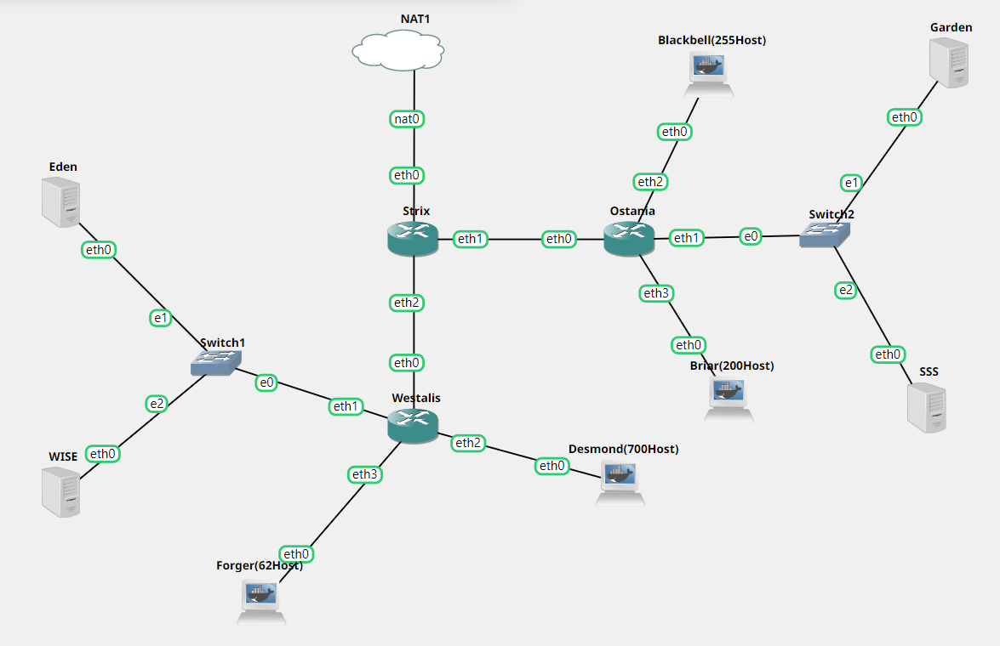

### (B.) VLSM Subnetting
Untuk membuat VLSM, pertama-tama, kita perlu membuat tabel yang berisi jumlah IP pada setiap subnet beserta totalnya

#### Tabel Subnet
| Subnet | Jumlah IP | Netmask |
| --- | --- | --- |
| A1 | 4 | /29 |
| A2 | 63 | /25 |
| A3 | 701 | /22 |
| A4 | 2 | /30 |
| A5 | 2 | /30 |
| A6 | 256 | /23 |
| A7 | 201 | /24 |
| A8 | 4 | /29 |
| Total | 1233 | /21 |

#### Konfigurasi IP dengan VLSM (Variable Length Subnet Masking)


#### VLSM Tree
Sehingga proyeksi tree dari VLSM-nya adalah sebagai berikut:


#### Pembagian IP
| Subnet | Network ID | Netmask | Broadcast |
| --- | --- | --- | --- |
| A1 | 192.182.0.8 | 255.255.255.248 | 192.182.0.15 |
| A2 | 192.182.0.128 | 255.255.255.128 | 192.182.0.255 |
| A3 | 192.182.4.0 | 255.255.252.0 | 192.182.7.255 |
| A4 | 192.182.0.0 | 255.255.255.252 | 192.182.0.3 |
| A5 | 192.182.0.4 | 255.255.255.252 | 192.182.0.7 |
| A6 | 192.182.2.0 | 255.255.254.0 | 192.182.3.255 |
| A7 | 192.182.1.0 | 255.255.255.0 | 192.182.1.255 |
| A8 | 192.182.0.16 | 255.255.255.248 | 192.182.0.23 |

### Konfigurasi GNS
#### Eden
```
auto eth0
iface eth0 inet static
	address 192.182.0.11
	netmask 255.255.255.248
	gateway 192.182.0.9
```

### WISE
```
auto eth0
iface eth0 inet static
	address 192.182.0.12
	netmask 255.255.255.248
	gateway 192.182.0.9
```

### Garden
```
auto eth0
iface eth0 inet static
	address 192.182.0.18
	netmask 255.255.255.248
	gateway 192.182.0.17
```

### SSS
```
auto eth0
iface eth0 inet static
	address 192.182.0.19
	netmask 255.255.255.248
	gateway 192.182.0.17
```

### Strix
```
#Strix
auto eth0
iface eth0 inet static
       address 192.168.122.2
       netmask 255.255.255.252
       gateway 192.168.122.1
       up echo nameserver 192.168.122.1 > /etc/resolv.conf

#A5
auto eth1
iface eth1 inet static
	address 192.182.0.1
	netmask 255.255.255.252

#A4
auto eth2
iface eth2 inet static
	address 192.182.0.5
	netmask 255.255.255.252
```

### Westalis
```
#Westalis
#A4
auto eth0
iface eth0 inet static
	address 192.182.0.6
	netmask 255.255.255.252
	gateway 192.182.0.5
#A1
auto eth1
iface eth1 inet static
	address 192.182.0.9
	netmask 255.255.255.248

#A3
auto eth2
iface eth2 inet static
	address 192.182.4.1
	netmask 255.255.252.0

#A2
auto eth3
iface eth3 inet static
	address 192.182.0.129
	netmask 255.255.255.128
```

### Ostania
```
#Ostania
auto eth0
iface eth0 inet static
	address 192.182.0.2
	netmask 255.255.255.252
	gateway 192.182.0.1

#A8
auto eth1
iface eth1 inet static
	address 192.182.0.17
	netmask 255.255.255.248

#A6
auto eth2
iface eth2 inet static
	address 192.182.2.1
	netmask 255.255.255.254

#A7
auto eth3
	iface eth3 inet static
	address 192.182.1.1
	netmask 255.255.255.0
```

### Forger(62Host)
```
auto eth0
iface eth0 inet static
	address 192.182.0.130
	netmask 255.255.255.128
	gateway 192.182.0.129
```

### Desmond(700Host)
```
auto eth0
iface eth0 inet static
	address 192.182.4.2
	netmask 255.255.255.0
	gateway 192.182.4.1
```

### Blackbell(255Host)
```
auto eth0
iface eth0 inet static
	address 192.182.2.2
	netmask 255.255.254.0
	gateway 192.182.2.1
```

### Briar(200Host)
```
auto eth0
iface eth0 inet static
	address 192.182.1.2
	netmask 255.255.255.0
	gateway 192.182.1.1
```

### (C.) Routing
#### Strix
```
route add -net 192.182.0.8 netmask 255.255.255.248 gw 192.182.0.2
route add -net 192.182.0.128 netmask 255.255.255.128 gw 192.182.0.2
route add -net 192.182.4.0 netmask 255.255.252.0 gw 192.182.0.2

route add -net 192.182.2.0 netmask 255.255.254.0 gw 192.182.0.6
route add -net 192.182.1.0 netmask 255.255.255.0 gw 192.182.0.6
route add -net 192.182.0.16 netmask 255.255.255.248 gw 192.182.0.6
```

#### Ostania
```
route add -net 0.0.0.0 netmask 0.0.0.0 gw 192.182.0.5
```

#### Westalis
```
route add -net 0.0.0.0 netmask 0.0.0.0 gw 192.182.0.1
```

### (D.) Tugas berikutnya adalah memberikan ip pada subnet Forger, Desmond, Blackbell, dan Briar secara dinamis menggunakan bantuan DHCP server. Kemudian kalian ingat bahwa kalian harus setting DHCP Relay pada router yang menghubungkannya.

1. Install `apt-get install isc-dhcp-relay -y` pada Ostania, Strix, dan Westalis, `apt-get install isc-dhcp-server` pada WISE
2. Pada Router (Ostania, Strix, dan Westalis) jalankan command berikut
    ```
    net.ipv4.ip_forward=1
    net.ipv4.conf.all.accept_source_route = 1
    ```
3. Lakukan sysctl -p
4. Buka `file /etc/default/isc-dhcp-relay` dan edit server dengan mengarahkan dchp-relay menuju WISE `192.182.0.12` lalu `service isc-dhcp-relay restart` pada Ostania, Strix, dan Westalis
```
echo '
SERVERS="192.182.0.12"
INTERFACES="eth0 eth1 eth2 eth3"
OPTIONS=
' > /etc/default/isc-dhcp-relay
```
5. Pada Jipangu edit file `/etc/default/isc-dhcp-server` dengan menambahkan:
`INTERFACES="eth0"`
6. Pada dhcp-server isikan data pada `/etc/dhcp/dhcpd.conf` di WISE, lalu lakukan `service isc-dhcp-server restart`
```
# Subnet A1
subnet 192.182.0.8 netmask 255.255.255.248 {
}

# Subnet A2
subnet 192.182.0.128 netmask 255.255.255.128 {
    range 192.182.0.130 192.182.0.255;
    option routers 192.182.0.129;
    option broadcast-address 192.182.0.255;

    option domain-name-servers 192.182.0.10;

    default-lease-time 360;
    max-lease-time 7200;
}

# Subnet A3
subnet 192.182.4.0 netmask 255.255.252.0 {
    range 192.182.4.2 192.182.7.255;
    option routers 192.182.4.1;
    option broadcast-address 192.182.7.255;

    option domain-name-servers 192.182.0.10;

    default-lease-time 360;
    max-lease-time 7200;
}

# Subnet A6
subnet 192.182.2.0 netmask 255.255.254.0 {
    range 192.182.2.2 192.182.3.255;
    option routers 192.182.2.1;
    option broadcast-address 192.182.3.255;

    option domain-name-servers 192.182.0.10;

    default-lease-time 360;
    max-lease-time 7200;
}

# Subnet A7
subnet 192.182.1.0 netmask 255.255.255.0 {
    range 192.182.1.2 192.182.1.255;
    option routers 192.182.1.1;
    option broadcast-address 192.182.1.255;

    option domain-name-servers 192.182.0.10;

    default-lease-time 360;
    max-lease-time 7200;
```
7. Lakukan restart di node yang dijadikan ip dhcp

### 1.	Agar topologi yang kalian buat dapat mengakses keluar, kalian diminta untuk mengkonfigurasi Strix menggunakan iptables, tetapi Loid tidak ingin menggunakan MASQUERADE.
#### Strix
Command yang digunakan `iptables -t nat -A POSTROUTING -o eth0 -j SNAT -s 192.182.0.0/21 --to-source 192.168.122.2` (ip eth0) yang menyesuaikan dari eth0 tersebut

Lalu, pada semua node yang terkait, jalankan command berikut:
```
echo '
nameserver 192.168.122.1
' > /etc/resolv.conf
```

Keterangan:
- IP eth0 akan selalu berganti ketika restart node pada Strix atau restart GNS3 dengan rentang IP yang sudah dijelaskan 
- Cara mengetahui eth0, masukan command `ip a` pada Strix

#### Testing
Lakukan `ping google.com` pada sembarang node selain DHCP, misal pada Forger.
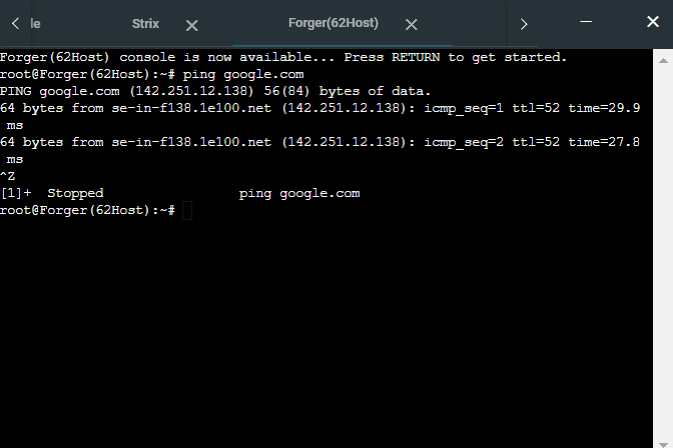

### 2.	Kalian diminta untuk melakukan drop semua TCP dan UDP dari luar Topologi kalian pada server yang merupakan DHCP Server demi menjaga keamanan.
#### Strix
```
iptables -A FORWARD -d 192.182.0.12 -i eth0 -p tcp -j DROP
iptables -A FORWARD -d 192.182.0.12 -i eth0 -p udp -j DROP
```

#### Keterangan:
- `A FORWARD:` Menggunakan chain FORWARD
- `p tcp:` Mendefinisikan protokol yang digunakan, yaitu tcp
- `p udp:` Mendefinisikan protokol yang digunakan, yaitu udp
- `d 192.182.0.12:` Mendefinisikan alamat tujuan dari paket (DHCP) berada pada subnet 192.182.0.12
- `i eth0:` Paket masuk dari eth0 Strix
- `j DROP:` Paket di-drop

#### Testing
1. Install netcat di server WISE dan Eden: `apt-get install netcat`
2. Pada WISE dan Eden ketikkan: `nc -l -p 80`
3. Pada WISE ketikkan: `nmap -p 80 192.182.0.12`: <br />
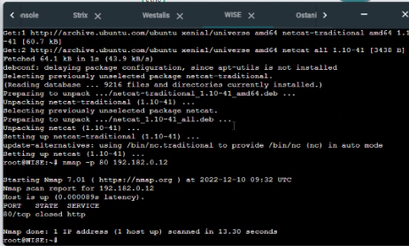

4. Testing dengan command `nmap -sU -p 67 192.182.0.12`: <br />
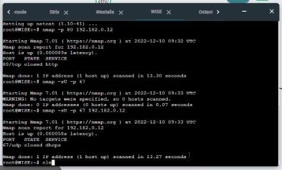

### 3.	Loid meminta kalian untuk membatasi DHCP dan DNS Server hanya boleh menerima maksimal 2 koneksi ICMP secara bersamaan menggunakan iptables, selebihnya didrop.
#### WISE dan Eden 
- Pada file `/root/iptables.sh`:
```
iptables -A INPUT -p icmp -m connlimit --connlimit-above 2 
```

#### Keterangan:
- `A INPUT:` Menggunakan chain INPUT
- `p icmp:` Mendefinisikan protokol yang digunakan, yaitu ICMP (ping)
- `m connlimit:` Menggunakan rule connection limit
- `connlimit-above 2:` Limit yang ditangkap paket adalah di atas 2
- `connlimit-mask 0 :` Hanya memperbolehkan 2 koneksi setiap subnet dalam satu waktu
- `j DROP:` Paket di-drop

#### Testing
Ping ke WISE secara bersamaan

##### Westalis
`ping 192.182.0.12` <br />
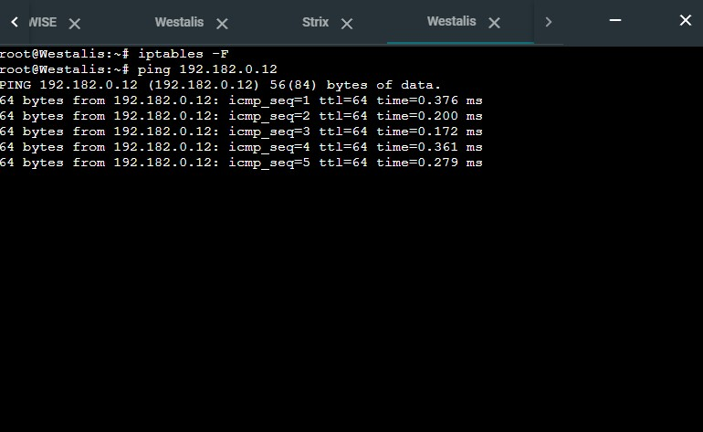

##### Briar
`ping 192.182.0.12` <br />
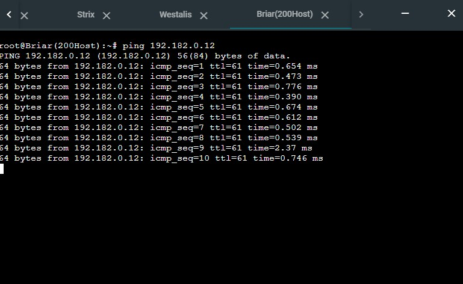

##### Strix
`ping 192.182.0.12` <br />
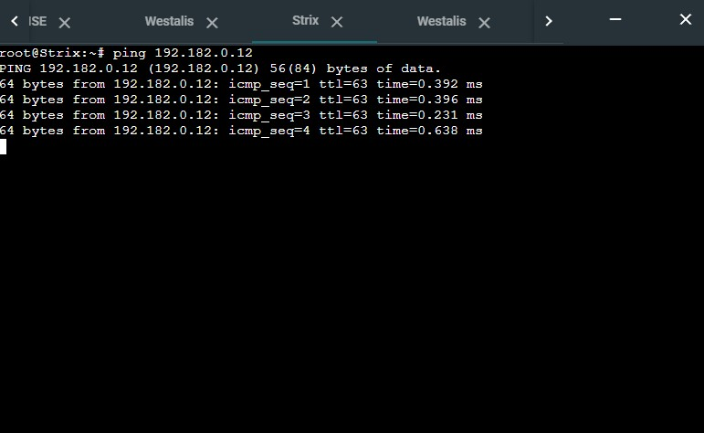

##### Pada saat yang ke-3 mengakses node yang sama, maka akan ditolak.
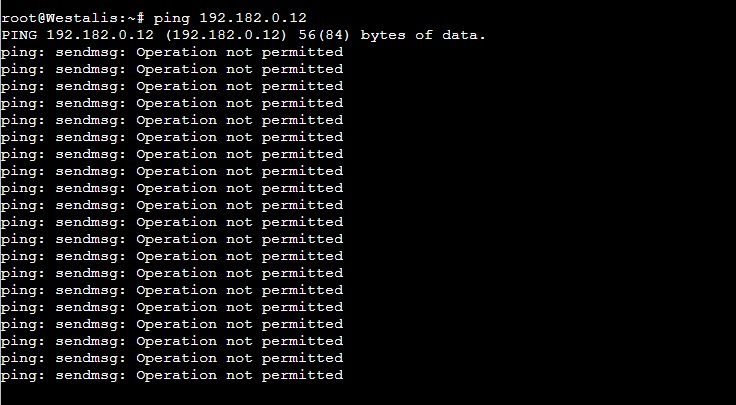

### 4.	Akses menuju Web Server hanya diperbolehkan disaat jam kerja yaitu Senin sampai Jumat pada pukul 07.00 - 16.00.
#### Garden dan SSS
```
iptables -A INPUT -m time --timestart 07:00 --timestop 16:00 --weekdays Mon,Tue,Wed,Thu,Fri -j ACCEPT
iptables -A INPUT -j REJECT
```
#### Keterangan:
- `A INPUT :` Menggunakan chain INPUT
- `m time :` Menggunakan rule time
- `weekdays Mon,Tue,Wed,Thu,Fri:` Melimitasi hanya untuk weekdays (Senin-Jumat)
- `timestart 07:00 :` Mendefinisikan waktu mulai yaitu 07:00
- `timestop 16:00 :` Mendefinisikan waktu berhenti yaitu 16:00
- `j REJECT :` Paket ditolak

#### Testing
Lakukan command `ping 192.182.0.19` (IP SSS) pada node Forger, Desmond, Blackbell, maupun Briar dengan konfigurasi waktu yang berbeda.
- Hari Senin jam 10 pagi: `date -s "5 Dec 2022 10:00:00"`
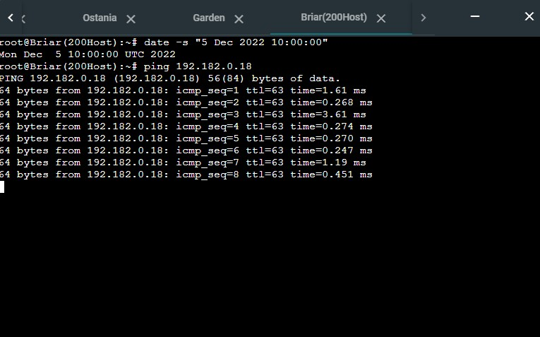
- Hari Senin jam 9 malam: `date -s "5 Dec 2022 21:00:00"`
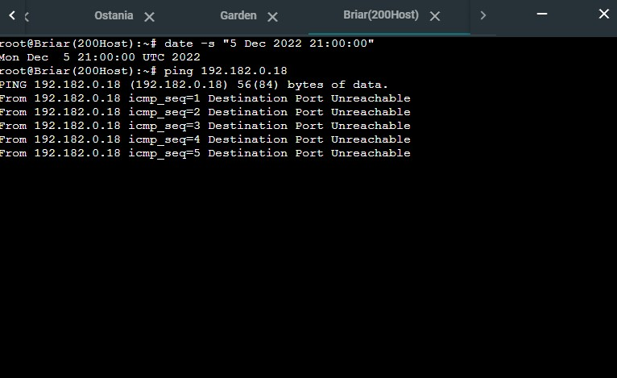

### 5.	Karena kita memiliki 2 Web Server, Loid ingin Ostania diatur sehingga setiap request dari client yang mengakses Garden dengan port 80 akan didistribusikan secara bergantian pada SSS dan Garden secara berurutan dan request dari client yang mengakses SSS dengan port 443 akan didistribusikan secara bergantian pada Garden dan SSS secara berurutan.
#### Eden
- Membuat konfigurasi berikut pada file `/etc/bind/named.conf.options`:
```
echo '
options {
        directory "/var/cache/bind";
        forwarders {
                192.168.122.1;
        };
        // dnssec-validation auto;
        allow-query{any;};
        auth-nxdomain no;    # conform to RFC1035
        listen-on-v6 { any; };
};
' > /etc/bind/named.conf.options
```

#### Ostania
Masukkan perintah:
```
iptables -A PREROUTING -t nat -p tcp -d 192.182.0.19 --dport 80 -m statistic --mode nth --every 2 --packet 0 -j DNAT --to-destination 192.182.0.19:80
iptables -A PREROUTING -t nat -p tcp -d 192.182.0.19 --dport 80 -j DNAT --to-destination 192.182.0.18:80
iptables -A PREROUTING -t nat -p tcp -d 192.182.0.18 --dport 443 -m statistic --mode nth --every 2 --packet 0 -j DNAT --to-destination 192.182.0.18:443
iptables -A PREROUTING -t nat -p tcp -d 192.182.0.18 --dport 443 -j DNAT --to-destination 192.182.0.19:443
```

#### Garden
- Marker Garden pada file index.html
```
echo 'Garden' > '/var/www/html/index.html'
```
```
echo 'Listen 80
Listen 443' > '/etc/apache2/ports.conf'
```

#### SSS
- Marker SSS pada file index.html
```
echo 'SSS' > '/var/www/html/index.html'
```
```
echo 'Listen 80
Listen 443' > '/etc/apache2/ports.conf'
```

#### Testing
##### SSS
- Pada Client (ex: Briar), jalankan perintah `curl 192.182.0.19`
Hasil:
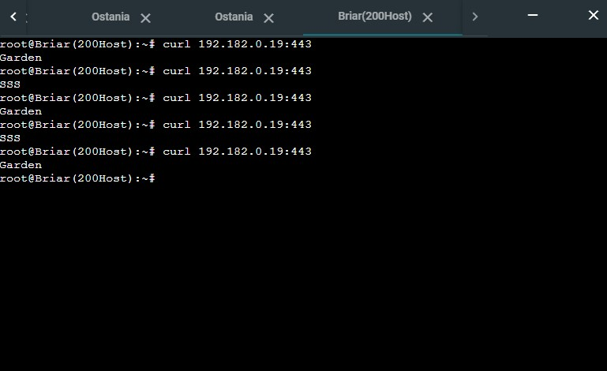
##### Garden
- Pada Client (ex: Briar), jalankan perintah `curl 192.182.0.18`
Hasil:
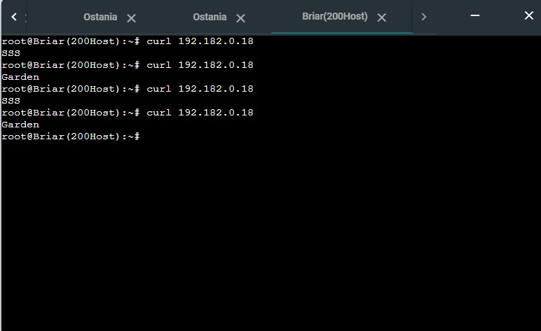


### 6.	Karena Loid ingin tau paket apa saja yang di-drop, maka di setiap node server dan router ditambahkan logging paket yang di-drop dengan standard syslog level.
1. Pada setiap node server maupun router tambahkan command berikut pada file `/root/syslog.sh`:
    ```
    # logging
    iptables -N LOGGING
    iptables -A INPUT -j LOGGING
    iptables -A OUTPUT -j LOGGING
    iptables -A LOGGING -m limit --limit 2/min -j LOG --log-prefix "IPTables-Droppe$
    iptables -A LOGGING -j DROP

    # rsyslog
    echo '
    kern.warning /var/log/iptables.log
    ' >> /etc/rsyslog.conf

    # rsyslog restart
    /etc/init.d/rsyslog restart
    ```
2. Pada file `.bashrc` tambahkan command berikut: `bash /root/syslog.sh`

#### Testing
- Kirim paket dari node lain ke web server seperti Garden (untuk melakukan testing drop dari rule firewall yang sudah dibuat)
Pada Forger, kirim paket dengan command `ping 192.182.0.18`
- Cek UCP TCP dengan command berikut pada client:
    ```
    nmap -sU 192.182.0.12 -p 443
    nmap -sT www.google.com -p 443
    ```
- Testing terhadap beberapa jenis waktu dengan beberapa kasus berikut:
    - Hari Senin jam 10 pagi: `date -s "5 Dec 2022 10:00:00"`
    - Hari Senin jam 9 malam: `date -s "5 Dec 2022 21:00:00"`
    - Hari Minggu jam 10 pagi: `date -s "4 Dec 2022 10:00:00"`
    - Hari Minggu jam 9 malam: `date -s "4 Dec 2022 21:00:00"`
- Cek apache html dengan command berikut pada web server ():
    ```
    curl ip:80
    curl ip:443
    ```
- Clear iptables dan chain di node yang telah dipasang firewall:
    ```
    iptables -F
    iptables -X
    ```
- Jalankan perintah berikut untuk melihat logging drop dari iptables yang tercatat sistem log: `cat /var/log/iptables.log`
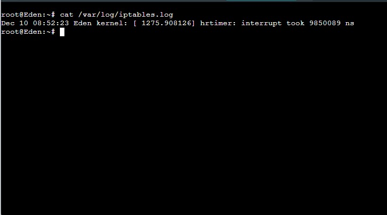
